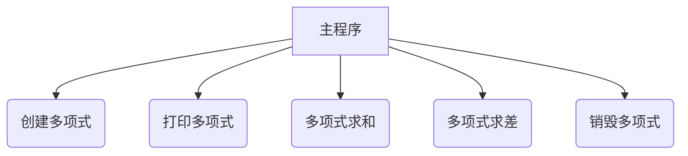
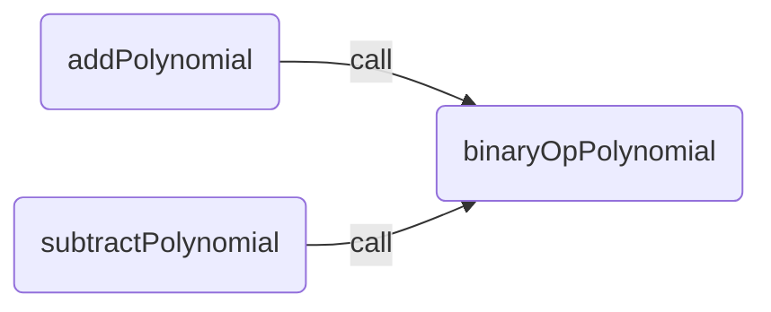

# 一元多项式实验报告

> 作者: 熊桐睿 PB23000200

## 一、问题描述

1. 实验题目：利用有序单向链表表示一元多项式

2. 基本要求：

  - 根据用户输入，创建一元多项式
  - 打印一元多项式
  - 对一元多项式求和
  - 对一元多项式求差
  - 销毁一元多项式

3. 测试数据：

  - $p_a=3x^20+12x^15-9x^12+6x^4+8$

    输入：`3 20 12 15 -9 12 6 4 8 0`

  - $p_b=5x^18-8x^15+9x^12-10x^8-9x^4+7x^2-4$

    输入：`5 18 -8 15 9 12 -10 8 -9 4 7 2 -4 0`

  预期输出：

  - 和：$3x^20+5x^18+4x^15-10x^8-3x^4+7x^2+4$

  - 差: $3x^20-5x^18+20x^15-18x^12+10x^8+15x^4-7x^2+12$

## 二、需求分析

1. 本实验可以输入和输出一元多项式，可以进行一元多项式的加法和减法运算

2. 输入的形式为系数和指数交替输入

2. 输出一元多项式时，需要考虑以下几点：

  - 系数为 0 的项不输出
  - 系数为 1 的项不输出系数
  - 系数为 -1 的项输出`-x`，而不是`-1x`
  - 指数为 0 的项输出系数，而不输出`x^0`

## 三、概要设计

### 1. 一元多项式数据类型定义：

```plaintext
ADT Polynomial {
  数据对象：D={ai|ai∈(系数,指数),i=1,2...,n,n≥0}
  数据关系：R={<ai-1,ai>|ai-1,ai∈D, ai-1≤ai ,i=2,...,n}
  基本操作：
    CreatePolyn(&p,m)       // 创建一元多项式，可从终端接受 m 组（p,e）系数/指数组。
    AddPolyn(&pa,&pb)       // 实现两个一元多项式的加法
    SubtractPolyn(&pa,&pb)  // 实现两个一元多项式的减法
    PrintPolyn(p)           // 实现在屏幕打印出一个一元多项式，形如 3x^10+9x^5+8
    DostroyPolyn(&p)        // 销毁多项式
} ADT Polynomial
```

### 2. 主程序流程及其模块调用关系



## 四、详细设计

### 1. 数据结构定义

```typescript
interface Polynomial {
  p: number
  e: number
  next?: Polynomial
}
```

### 2. create

```typescript
/**
 * @param p 头节点
 * @param m 项数
 */
function createPolynomial(p: Polynomial, m: number) {
  for (let i = 0; i < m; i++) {
    p = p.next = {
      p: readInt(),
      e: readInt()
    }
  }
}
```

### 3. print

```typescript

function printPolynomial(p: Polynomial) {
  let first = true
  while (p.next) {
    p = p.next
    writeStr(`${p.p >= 0 && !first ? '+' : ''}${p.p === 1 ? '' : p.p}${p.e ? `x^${p.e}` : ''}`)
    first = false
  }
}
```

### 4. add and subtract

```typescript
/**
 * 加减法的共同通用操作
 */
function binaryOpPolynomial(p1: Polynomial, p2: Polynomial, op: (a: number, b: number) => number) {
  // 创建结果的头节点
  const head = emptyNode()
  let p = head

  // 遍历，直到 p1 或 p2 结束
  while (p1.next && p2.next) {
    const np1 = p1.next
    const np2 = p2.next
    if (np1.e === np2.e) {
      // 指数相同，进行运算
      const res = op(np1.p, np2.p)
      if (res)
        p = p.next = { p: res, e: np1.e }
      p1 = np1
      p2 = np2
    } else if (np1.e > np2.e) {
      // np1 指数大，先添加 np1
      p = p.next = { p: op(np1.p, 0), e: np1.e }
      p1 = np1
    } else {
      // np2 指数大，先添加 np2
      p = p.next = { p: op(0, np2.p), e: np2.e }
      p2 = np2
    }
  }

  // 处理 p1 中的多余部分
  while (p1.next) {
    p1 = p1.next
    p = p.next = { p: op(p1.p, 0), e: p1.e }
  }

  // 处理 p2 中的多余部分
  while (p2.next) {
    p2 = p2.next
    p = p.next = { p: op(0, p2.p), e: p2.e }
  }
  return head
}

function addPolynomial(p1: Polynomial, p2: Polynomial) {
  return binaryOpPolynomial(p1, p2, (a, b) => a + b)
}

function subtractPolynomial(p1: Polynomial, p2: Polynomial) {
  return binaryOpPolynomial(p1, p2, (a, b) => a - b)
}
```

### 5. destory

```typescript
function destroyPolynomial(p: Polynomial) {
  while(p.next)
    freemem(p = p.next)
}
```

### 6. 函数调用关系图



## 五、调试分析

1. 本实验通过 [Vitest](https://vitest.dev) 单元测试框架进行测试。具体测试方式为 [In-Source Testing](https://vitest.dev/guide/in-source.html#in-source-testing)。内联的测试代码使得模块之间更加完整独立。Vitest 基于 [Vite](https://vitejs.dev) 构建，支持热更新（HMR），测试结果实时反馈。

2. 由于 Node.js 没有高层次的输入输出 API，且出于便于进行单元测试的考虑，本实验实现了虚拟的输入输出环境：

```typescript
// --- INPUT ---

let inputIndex = 0
let inputBuffer = ''

function readWord(delimiters = ' \n\t') {
  let result = ''
  while (inputIndex < inputBuffer.length && !delimiters.includes(inputBuffer[inputIndex])) {
    result += inputBuffer[inputIndex]
    inputIndex++
  }
  while (inputIndex < inputBuffer.length && delimiters.includes(inputBuffer[inputIndex])) {
    inputIndex++
  }
  return result
}

export function readLine() {
  return readWord('\n')
}

export function readStr() {
  return readWord()
}

export function readInt() {
  return parseInt(readWord())
}

export function readFloat() {
  return parseFloat(readWord())
}

export function readChar() {
  return inputBuffer[inputIndex++] ?? ''
}

export function setInput(newInput: string) {
  inputIndex = 0
  inputBuffer = newInput
}

// --- OUTPUT ---

let outputBuffer = ''

export function writeStr(...args: any[]) {
  outputBuffer += args.join(' ')
}

export function writeLine(...args: any[]) {
  outputBuffer += outputBuffer.length === 0 ? args.join(' ') : '\n' + args.join(' ')
}

export function getOutput() {
  const result = outputBuffer
  outputBuffer = ''
  return result
}
```

3. 算法的时空分析

  由于采用的是带有头节点的有序链表，各种操作的算法时间复杂度比较合理，Create，Print，Destroy 的时间复杂度均为 $O(n)$，其中 n 为多项式的项数；Add，Subtract 的时间复杂度为 $O(n+m)$，其中 n 和 m 分别为两个多项式的项数。

  所有算法的空间复杂度都是 $O(1)$。

## 六、使用说明

使用本程序可以创建、打印、求和、求差、销毁一元多项式。

## 七、测试结果

通过全部了 5 组单元测试：

```ts
const { describe, test, expect } = import.meta.vitest
describe('1_poyn', () => {
  const p1 = emptyNode()
  const p2 = emptyNode()

  test('create', () => {
    setInput('3 20 12 15 -9 12 6 4 8 0')
    createPolynomial(p1, 5)
    setInput('5 18 -8 15 9 12 -10 8 -9 4 7 2 -4 0')
    createPolynomial(p2, 7)
  })

  test('print', () => {
    printPolynomial(p1)
    expect(getOutput()).toBe("3x^20+12x^15-9x^12+6x^4+8")
    printPolynomial(p2)
    expect(getOutput()).toBe("5x^18-8x^15+9x^12-10x^8-9x^4+7x^2-4")
  })

  test('add', () => {
    const p = addPolynomial(p1, p2)
    printPolynomial(p)
    expect(getOutput()).toBe("3x^20+5x^18+4x^15-10x^8-3x^4+7x^2+4")
  })

  test('subtract', () => {
    const p = subtractPolynomial(p1, p2)
    printPolynomial(p)
    expect(getOutput()).toBe("3x^20-5x^18+20x^15-18x^12+10x^8+15x^4-7x^2+12")
  })

  test('destroy', () => {
    destroyPolynomial(p1)
    destroyPolynomial(p2)
  })
})
```

该实验源码文件的覆盖率如下：

```text
Statements   : 94.82% ( 110/116 )
Branches     : 90.62% ( 29/32 )
Functions    : 100%   ( 7/7 )
Lines        : 94.82% ( 110/116 )
```

## 八、附录

- 源码存储库：https://github.com/KermanX/DS_hw_experiments

- 源程序文件清单：

  ```text
  src
  │  1_polyn.ts
  │
  └─utils
          io.ts
          memory.ts
  ```
